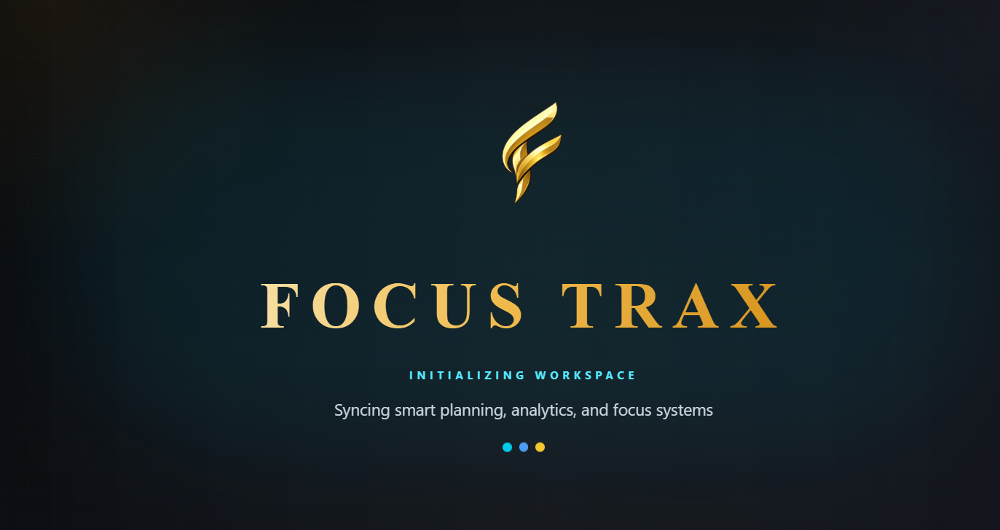
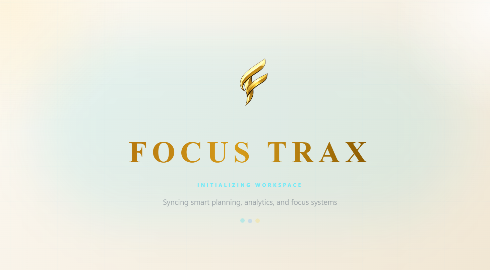
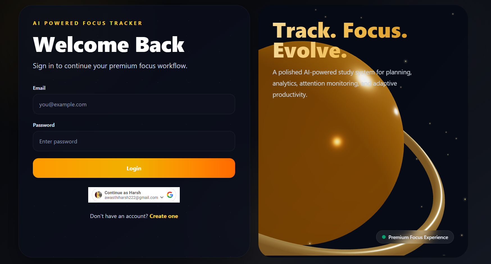
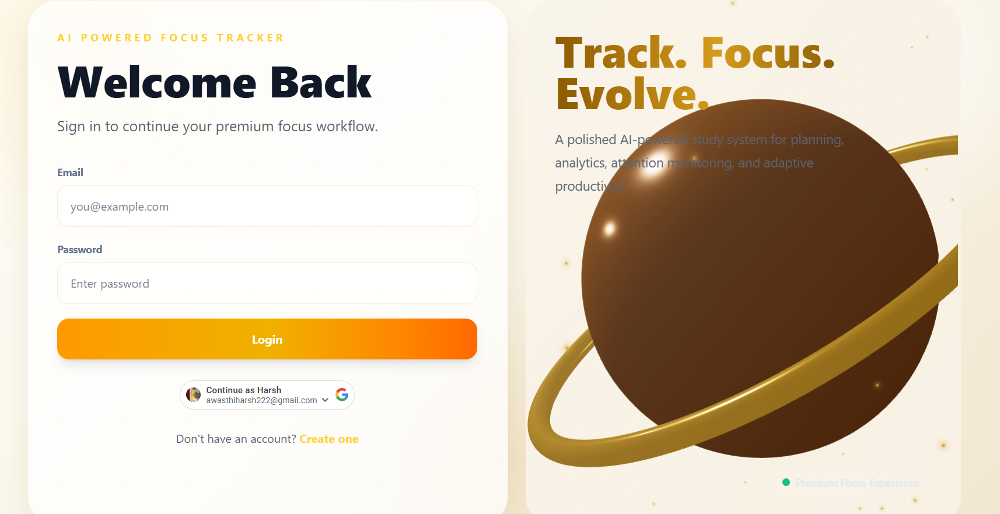
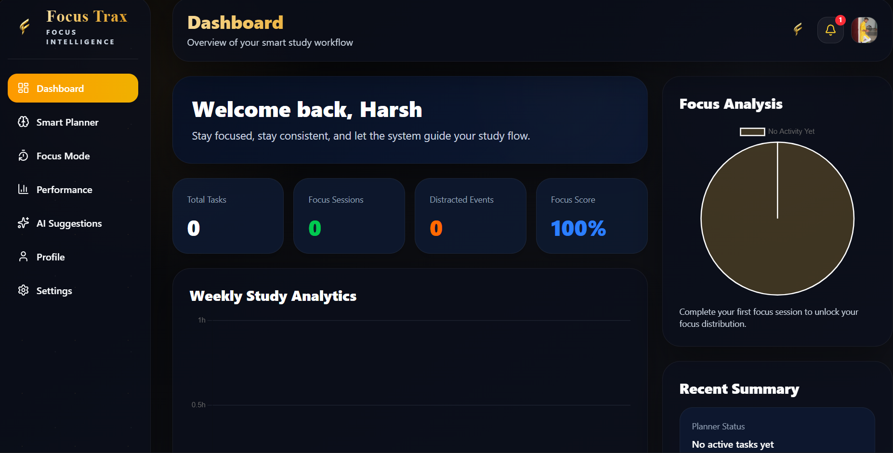
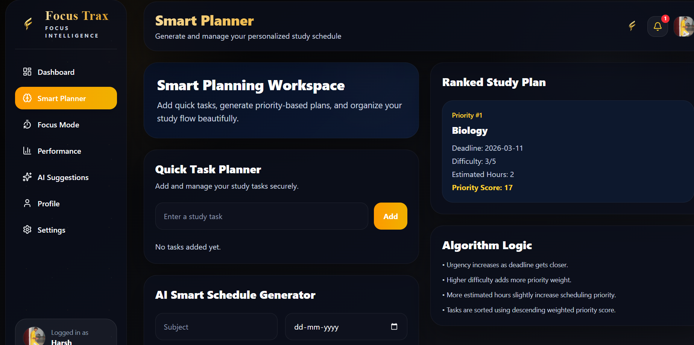
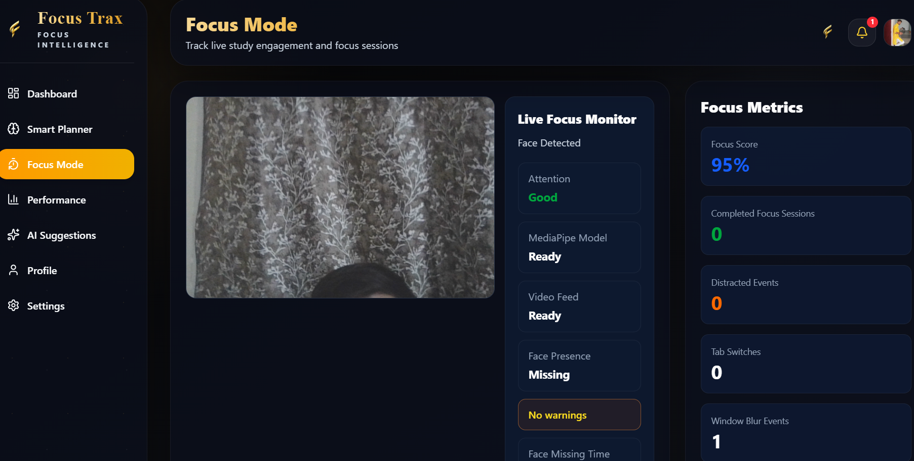
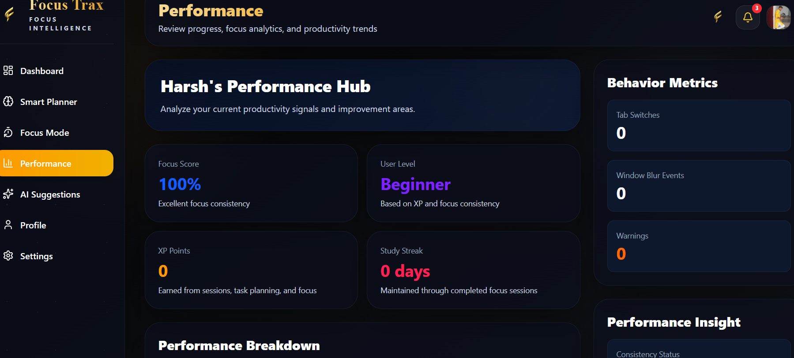

# 🚀 Focus Trax

**Focus Trax** is an AI-powered smart study planner designed to help students study smarter, stay focused, and build consistent productivity habits.

It combines **personalized study planning**, **focus session tracking**, **task management**, and **performance insights** into one modern platform. The goal is to reduce study stress, improve consistency, and make preparation more structured and effective.

---

## 🌐 Live Demo

🔗 **App Link:** [Focus Trax Live](https://focus-trax.vercel.app)

---

## ✨ Features

- 📅 **Smart Study Planner**  
  Create personalized study schedules based on tasks, goals, and priorities.

- ⏳ **Focus Session Tracking**  
  Track study sessions with a focus-friendly workflow to improve concentration.

- 📝 **Task & Goal Management**  
  Add, organize, and monitor study tasks efficiently.

- 📊 **Performance Insights**  
  View productivity trends, focus history, and study progress over time.

- 🤖 **AI-Powered Productivity Support**  
  Intelligent planning and adaptation to help users study better.

- 🔐 **Authentication System**  
  Secure user signup and login for personalized access.

- 🎨 **Modern UI/UX**  
  Clean, responsive, and visually engaging interface for a smooth user experience.

---

## 🛠️ Tech Stack

### Frontend
- React.js
- JavaScript
- HTML5
- CSS3
- Tailwind CSS

### Backend
- Node.js
- Express.js

### Database
- MongoDB

### Authentication & Utilities
- JWT Authentication
- OTP / Email Verification
- Resend / Email API Integration

### Deployment
- Frontend: *(https://focus-trax.vercel.app)*
- Backend: *(https://focus-trax-backend.onrender.com)*

---

## 📸 Screenshots

